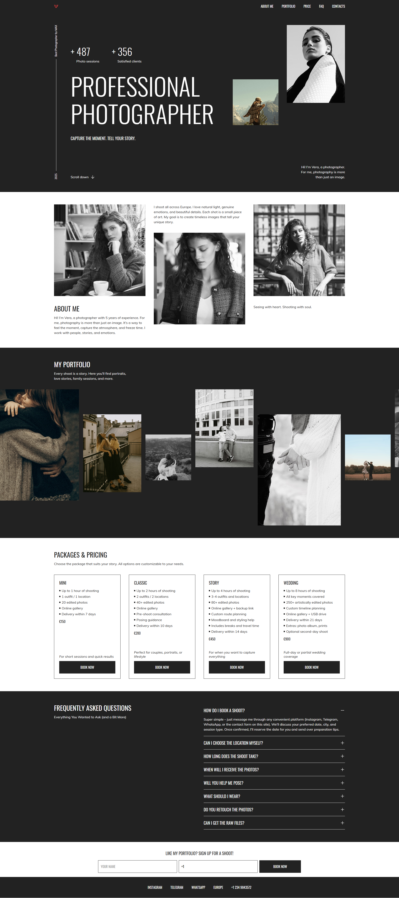

# Photographer Portfolio Website

**A responsive portfolio website for photographers featuring modern design, interactive components, and optimized performance.**

Live Demo: https://azizshik.github.io/photographer-portfolio/

## Features

### Responsive Design:

- Mobile-first approach with breakpoints at 1440px, 768px, and 380px
- Fluid layouts using relative units (%, rem, vh)
- No horizontal scroll at any viewport width

### Interactive Components:

- Burger menu with smooth animations
- Portfolio image slider with touch/swipe support
- FAQ accordion with localStorage persistence
- Modal booking system
- Smooth scrolling navigation

### Performance Optimization:

- Modern Image Formats: WebP and AVIF implementation
- Fallback System: JPEG/PNG for browser compatibility
- Responsive Images: srcset and sizes attributes
- Lazy Loading: Native loading="lazy" attribute
- File Size Reduction: 60-80% smaller images with WebP/AVIF

### Visual Details:

- Hover effects on interactive elements
- Smooth CSS transitions and animations
- Background sections stretching full viewport width

## Screenshot

## Tech Stack

- HTML5: Semantic markup with modern image formats
- CSS3: Grid, Flexbox, CSS Variables
- JavaScript: Vanilla JS, no frameworks
- Performance: WebP/AVIF images, lazy loading
- Responsive: Fully adaptive from 380px to 1440px+

### Key Achievements:

- WebP/AVIF image optimization pipeline
- Cross-browser compatibility with fallbacks
- W3C validated markup
- Mobile touch support

## Task

This project was completed as part of **The Rolling Scopes School** JavaScript course.

Made with passion by [@azizshik](https://github.com/azizshik)
